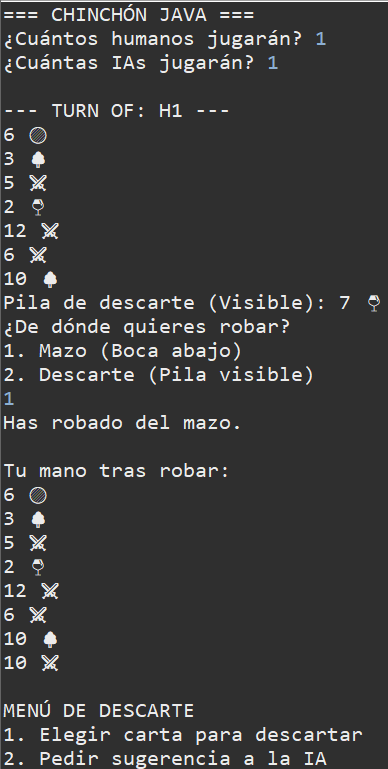
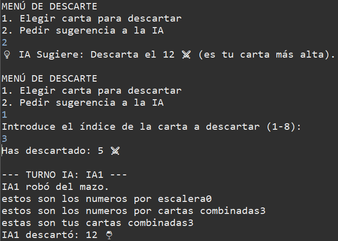
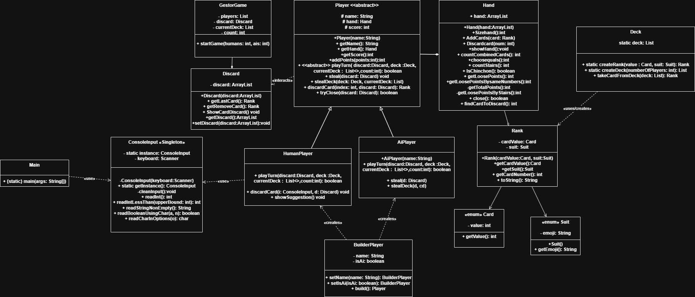
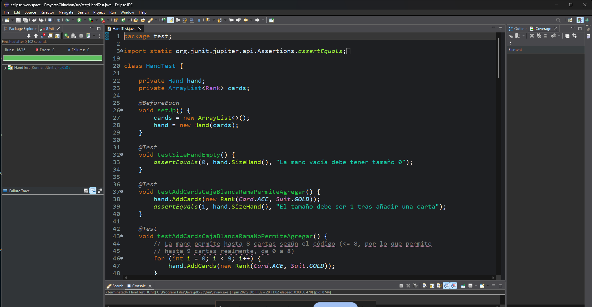
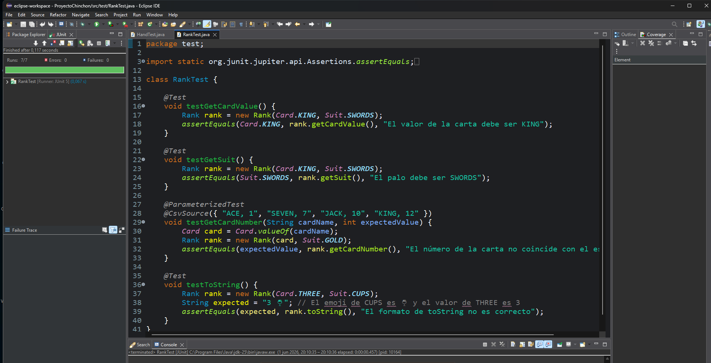
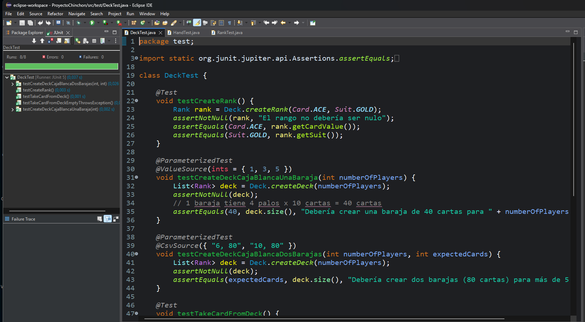

#  Proyecto Chinchón - Módulo Entornos de Desarrollo

Este repositorio contiene el desarrollo del juego clásico de cartas **Chinchón**, implementado en Java. El proyecto ha sido estructurado siguiendo metodologías de diseño limpio, aplicación de patrones arquitectónicos, documentación estandarizada y validación sistemática mediante pruebas unitarias.

---

##  1. Explicación del Juego

### Objetivo del Juego
El objetivo principal del Chinchón es combinar las 7 cartas de la mano en grupos de tríos o cuartetos) o en escaleras. Reduciendo el valor de las cartas sueltas. La partida finaliza cuando un jugador consigue cerrar la mano con éxito o realiza un "Chinchón".

### Funcionamiento, Reglas y Jugabilidad
1. **Fase de Reparto:** Cada jugador recibe inicialmente 7 cartas del mazo principal (`Deck`). Se extrae una carta adicional y se coloca boca arriba en la pila de descarte (`Discard`).
2. **Flujo Dinámico del Turno:** En su respectivo turno, cada jugador realiza obligatoriamente las siguientes acciones:
   * **Robar:** De las de boca abajo o la de descarte del otro
   * **Acción y Evaluación:** La carta se pone en la mano (`Hand`).
   * **Descarte:** Para finalizar el turno, el jugador debe seleccionar una carta de su mano y arrojarla a la pila de descarte.
3. **Condición de Cierre:** Un jugador puede cerrar si es capaz de realizar combinaciones válidas de tal manera que las cartas no combinadas ("puntos sueltos") sumen cómo máximo 0 y 5 puntos, o si tiene Chinchón.

### Capturas de Pantalla de la Interfaz del Juego




---

##  2. Análisis del Proyecto

###  Estructura del Proyecto
El proyecto se ha organizado de forma modular, separando estrictamente el código de producción de los recursos de desarrollo:

* `src/app/`: Aloja las clases de control de flujo, el arranque de la aplicación y la gestión directa de las lecturas por teclado (`Main`, `GestorGame`, `ConsoleInput`, `BuilderPlayer`).
* `src/dominio/`: Contiene las clases del núcleo, modelando los componentes físicos de la baraja española (`Card`, `Suit`, `Rank`, `Deck`, `Hand`, `Discard`) y los que juegan (`Player`, `HumanPlayer`, `AiPlayer`).
* `test/` o `tests/`: **Ubicado estratégicamente fuera de la carpeta `src`**. Contiene las clases de pruebas de JUnit (`HandTest`, `DeckTest`, `RankTest`) garantizando que el código de testeo no se mezcle con los binarios de distribución finales.

---

### Diagrama de Clases UML Actualizado
A continuación se ilustra la arquitectura de clases, herencias y dependencias que dan soporte a la aplicación:



---

###  Descripción de Clases y Responsabilidades

* **`Main`**: Punto de entrada del programa. Inicializa la interfaz y delega el control.
* **`GestorGame`**: Clase controladora principal. Coordina los turnos, gestiona el flujo, el reparto de cartas y valida de manera global el final del juego.
* **`ConsoleInput`**:No permite ciertas cosas a las entradas del usuario por teclado, evitando caídas inesperadas de la aplicación.
* **`BuilderPlayer`**: Construye a ls jugadores Ia y a las personas.
* **`Player` (Clase Abstracta)**: Controla los turnos de los jugadores.
* **`HumanPlayer`**: Especialización de `Player` que implementa la toma de decisiones basada en los menús.
* **`AiPlayer`**: Especialización de `Player` hace lo mismo que lad e arriba solo que automatizado cogiendo las cartas mas grande sy descartandolas.
* **`Hand`**: Encapsula el comportamiento de las cartas de un jugador. Detecta las combinaciones (`countStairs`, `choosequals`) y el cálculo de penalizaciones.
* **`Deck`**: Controla los mazos para que no se repitan las cartas a menos q los jugadores pidan más mazos.
* **`Discard`**: Gestiona la pila visible de descartes.
* **`Rank`**: Hace la carta acoplando el número (`Card`) con su palo (`Suit`).
* **`Card` & `Suit` (Enums)**: Enums con los valores permitidos y emojis que indican su palo.

---

##  3. Patrones de Diseño Implementados

### 1. Patrón Singleton (Instancia Única)
* **Por qué se utiliza:**
* Se usan para asegurar que solo exista un único flujo activo de entrada de datos (`Scanner(System.in)`) en toda la aplicación, evitando fugas de memoria o conflictos por la apertura concurrente de múltiples flujos de lectura.
* Funciona ya que el constructor es estrictamente privado y el acceso se restringe a un método estático.
* **Ejemplo de Código:**
```java
// Ubicado en src/app/ConsoleInput.java
public class ConsoleInput {
    private static ConsoleInput instance;
    private Scanner keyboard;

    private ConsoleInput(Scanner keyboard) {
        this.keyboard = keyboard;
    }

    public static ConsoleInput getInstance() {
        if (instance == null) {
            instance = new ConsoleInput(new Scanner(System.in));
        }
        return instance;
    }
}
```
### 2. Patrón Builder (Constructor Progresivo)
* **Se aplica:** En [BuilderPlayer.java](src/app/BuilderPlayer.java).nSe usa para poder usar el builder en varias clases `Player` y `PlayerIA`.

* **Ejwmplo de Código:**

```java
public class BuilderPlayer {
    private String name;
    private boolean isAi;

    public BuilderPlayer setName(String name) {
        this.name = name;
        return this;
    }

    public BuilderPlayer setIsAi(boolean isAi) {
        this.isAi = isAi;
        return this;
    }

    public Player build() {
        if (isAi) {
            return new AiPlayer(name);
        } else {
            return new HumanPlayer(name);
        }
    }
}
````
## 3. Patrón Factory

* **Se aplica:**
En la interacción entre `BuilderPlayer.java` y `GestorGame.java`.
Se utiliza para abstraer al cliente (`GestorGame`) para saber de qué subclase concreta está instanciando.
El método `build()` actúa como una fábrica que encapsula la lógica de creación y devuelve la abstracción base `Player`.

### Ejemplo de Código de Uso

```java
for (int i = 0; i < humans; i++) {
    players.add(
        new BuilderPlayer()
            .setName("H" + (i + 1))
            .setIsAi(false)
            .build()
    );
}

for (int i = 0; i < ais; i++) {
    players.add(
        new BuilderPlayer()
            .setName("IA" + (i + 1))
            .setIsAi(true)
            .build()
    );
}
```

---

# 4. Pruebas Unitarias 

## Enfoque Utilizado

Para certificar la estabilidad de los algoritmos de descarte y combinaciones, se ha implementado una suite en **JUnit 5** utilizando dos metodologías:

### Caja Negra
Pruebas funcionales basadas estrictamente en las especificaciones de entrada y salida esperadas de las reglas de juego.

### Caja Blanca
Pruebas estructurales diseñadas analizando el código fuente para cubrir caminos específicos, condiciones límite y ramas condicionales (`if/else`).

---

## Ejemplos de Cobertura de Pruebas en la clase de `HandTest.java`

### A. Caja Blanca: Restricción de Tamaño de Mano

Se fuerza la ejecución de ambas ramas del condicional:

```java
@Test
void testAddCardsCajaBlancaRamaNoPermiteAgregar() {
    for (int i = 0; i < 9; i++) {
        hand.AddCards(new Rank(Card.ACE, Suit.GOLD));
    }

    assertEquals(
        9,
        hand.SizeHand(),
        "La mano alcanzó su límite máximo de control condicional"
    );
}
```

---

### B. Caja Negra: Validación de Reglas de Chinchón

Se verifica que una escalera de únicamente tres cartas no sea considerada un Chinchón.

```java
@Test
void testIsNotChinchon() {
    hand.AddCards(new Rank(Card.ACE, Suit.GOLD));
    hand.AddCards(new Rank(Card.TWO, Suit.GOLD));
    hand.AddCards(new Rank(Card.THREE, Suit.GOLD));

    assertFalse(
        hand.IsChinchon(),
        "No debe ser chinchón con solo 3 cartas en escalera"
    );
}
```

---

## 📸 Evidencias de Ejecución

Los test se ejecutan correctamente mostrando la característica **barra verde de JUnit**, indicando que todas las pruebas han sido superadas satisfactoriamente.
[HandTest.java](test/HandTest.java)


[RankTest.java](test/RankTest.java)


[DeckTest.java](test/DeckTest.java)


---

# 5. Documentación JavaDoc

El código fuente ha sido documentado exhaustivamente siguiendo los estándares oficiales de la API de Java para facilitar la legibilidad, comprensión y mantenimiento del proyecto.

## Estructura de la Documentación

Cada componente y método cuenta con su correspondiente bloque JavaDoc utilizando las anotaciones estándar:

- `@param` → Describe parámetros de entrada.
- `@return` → Describe el valor retornado.
- `@Override` → Indica sobrescritura de métodos heredados.

### Ejemplo de Documentación

```java
/**
 * Ejecuta de manera automatizada el turno correspondiente
 * a la Inteligencia Artificial.
 *
 * @param discard Instancia del descarte actual para evaluar robos visibles.
 * @param deck Instancia del mazo general del juego.
 * @param currentDeck Lista estructurada de cartas remanentes en el mazo.
 * @param count Contador incremental de turnos de la partida actual.
 *
 * @return true si la IA ha alcanzado las condiciones de cierre;
 *         false en caso contrario.
 */
@Override
public boolean playTurn(
        Discard discard,
        Deck deck,
        List<Rank> currentDeck,
        int count) {

    // Implementación del método
}
```

---
